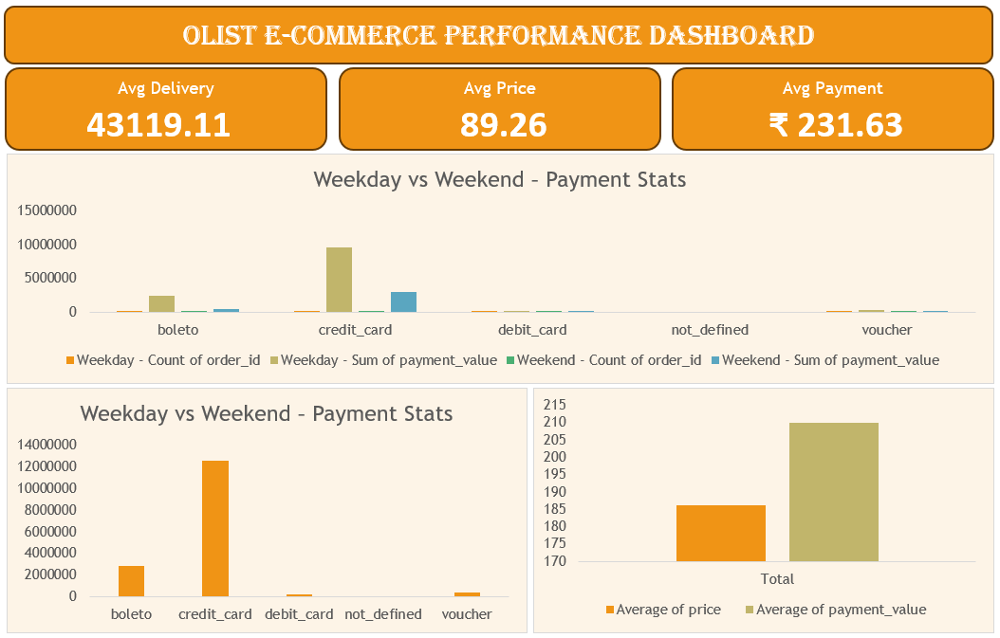

# 📊 Olist E-Commerce Performance Dashboard (Excel)

## 📌 Overview
The dashboard enables stakeholders to quickly identify behavioral patterns, operational bottlenecks, and customer satisfaction drivers.

---

## ⭐ STAR Method Breakdown

### **S — Situation** 
The Olist dataset was provided across multiple CSV files in **Brazilian Portuguese**, with fragmented information related to orders, payments, products, customers, and reviews.  
To generate meaningful KPIs, the data first needed to be **consolidated, standardized, and prepared** for analysis.

### **T — Task**
The objective was to:
- Clean and transform raw e-commerce data
- Translate required fields into English
- Design an **Excel-based dashboard** that answers key business questions:
  - Weekday vs Weekend payment behavior
  - High customer satisfaction linked to payment type
  - Delivery efficiency for specific product categories
  - Regional spending analysis
  - Impact of shipping time on customer reviews

### **A — Action**
The following steps were performed:

#### 🔹 Data Preparation
- Used **Power Query** to load, merge, and validate multiple datasets
- Applied the official **product category translation mapping table**
- Standardized city fields using **proper casing** (treated as proper nouns)
- Removed unstructured free-text review fields not required for KPI analysis

#### 🔹 Data Modeling
- Used `olist_orders_dataset` as the **central fact table**
- Merged supporting datasets (payments, reviews, items, products, customers) using appropriate keys
- Created helper columns in Excel:
  - Weekday / Weekend classification using `WEEKDAY()`
  - Delivery Days and Shipping Days using date arithmetic

#### 🔹 KPI Calculations
- Built Pivot Tables for all KPIs
- Used conditional aggregation (`COUNTIFS`, `AVERAGEIF`, `AVERAGEIFS`)
- Designed KPI cards and charts for clarity and business storytelling

#### 🔹 Dashboard Design
- Created a clean, single-page Excel dashboard with:
  - KPI cards
  - Comparison charts
  - Trend and relationship visuals
- Ensured separation between **data layer, calculation layer, and visualization layer**

### **R — Result**
The final Excel dashboard provides:
- Clear comparison of **weekday vs weekend payment behavior**
- Identification of **highly satisfied customers using credit cards**
- Insight into **delivery performance for pet shop products**
- Analysis of **average price and payment values for São Paulo customers**
- Visualization of the **relationship between shipping duration and review scores**

The dashboard is **dynamic, scalable, and presentation-ready**, serving as a strong foundation for further analysis using **SQL, Tableau, and Power BI** in subsequent weeks.
These insights can directly support decisions around payment strategy, logistics optimization, and customer experience improvements.

---

## 📌 Key Skills Demonstrated
- Data Cleaning & Transformation  
- Data Modeling & Joins  
- KPI Design & Business Analysis  
- Excel Dashboard Development  
- Analytical Storytelling  

---

## 📊 Dashboard

A comprehensive Excel dashboard transforming raw Olist data into actionable e-commerce insights.

---

## 🛠 Tools & Technologies
- Microsoft Excel (Pivot Tables, Formulas, Dashboarding)
- Power Query (Data Cleaning & Merging)
- GitHub (Documentation)

---

## 🏁 Conclusion
This project demonstrates end-to-end analytical capability—from raw data cleaning to KPI-driven storytelling.
The Excel dashboard delivers actionable insights into customer behavior, payments, and delivery performance, while remaining scalable for advanced BI tools like SQL, Tableau, and Power BI.

--- 

## 👤 Author
**Shadan**   
_Data Analyst_

🔗 [LinkedIn Profile](https://www.linkedin.com/in/shadansarfaraz1)  
🔗 [Tableau Public Profile](https://public.tableau.com/app/profile/shadansarfaraz/vizzes)
🔗 [Newsletter](https://shadansarfaraz.substack.com/)

---

## ⭐ Show Your Support
If you found this project insightful, give it a **⭐ Star** on GitHub — it helps others discover it too!  
Connect on **LinkedIn** for more Power BI, Tableau, and Data Analytics projects.